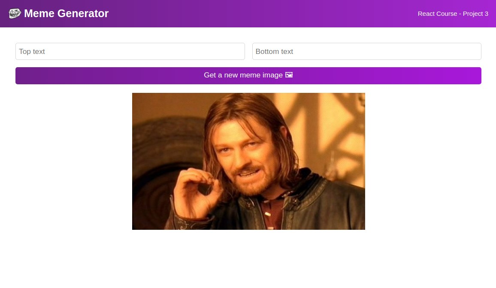
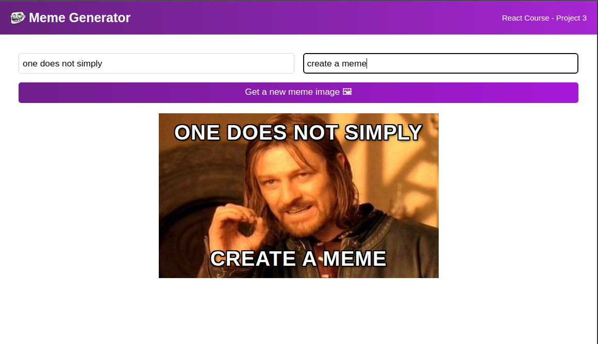
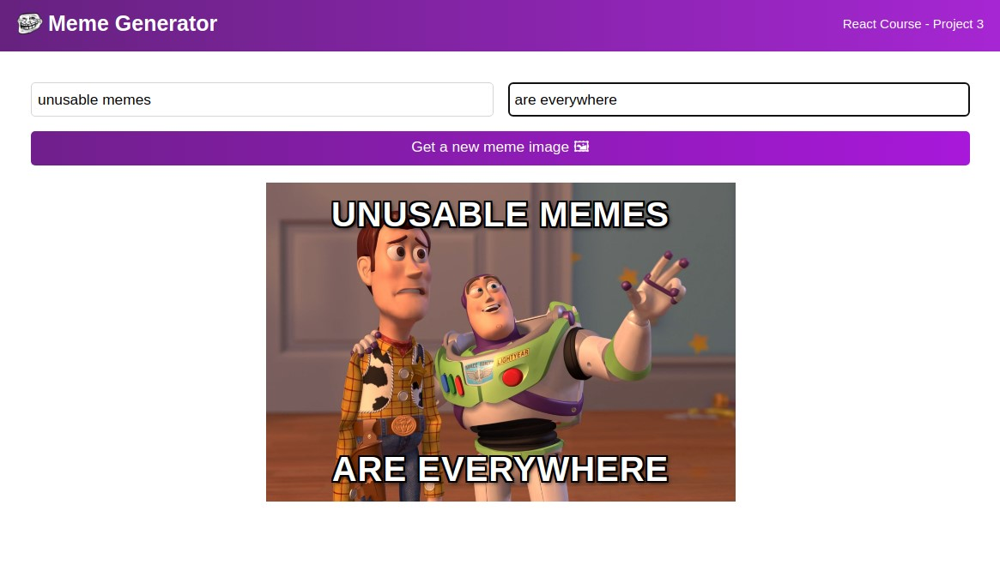

# Meme Generator
In section 3, Bob guides you through building his classic meme generator, updated with the newest React features.

## Table of contents
- [Introduction](#introduction)
- [Overview](#overview)
  - [Screenshot](#screenshot)
  - [Built using](#built-using)
  - [Lessons Learned](#lessons-learned)
- [Author](#author)
- [Acknowledgement](#acknowledgement)
- [Additional Note](#additional-note)

## Introduction
- This is my solution to the third part of [Learn React](https://scrimba.com/learn/learnreact).
- This webpage was setup using [Vite](https://vitejs.dev/).
- This webpage features:
    - Interactive components
    - API calls

## Overview
- Link: [github.com/kierhb/meme-generator](https://github.com/kierhb/meme-generator)

### Screenshot

### Built using

- HTML5 markup
- CSS
- Vanilla JavaScript
- ReactJS

### Lessons Learned

- Adding Event listeners
- State
- Conditional Rendering
- Forms:
    - Text area
    - Checkbox
    - Radio buttons
    - Select & Option
    - Submitting the form
- Understanding Side effects
- Making API calls

## Author

- GitHub - [@kierhb](https://github.com/kierhb)
- LinkedIn - [Kier Bobila](https://www.linkedin.com/in/kier-bobila/)

## Acknowledgement
I want to acknowledge the course instructor Bob Ziroll and to all members of Scrimba community.

## Additional Note
Not all memes are applicable for this app, only those with upper and lower text boxes only.

